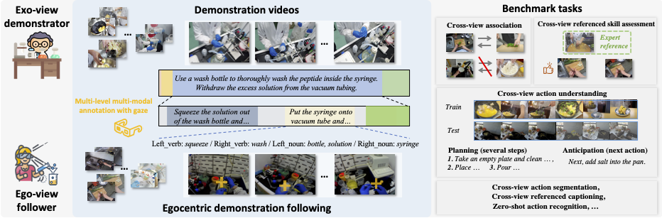
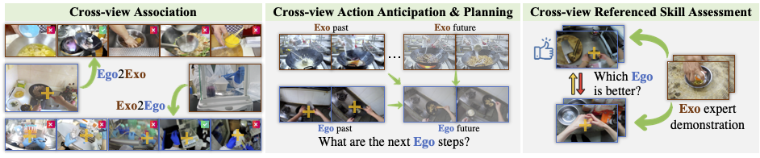

# EgoExoLearn 
This repository contains the data and benchmark code of the following paper:
> **EgoExoLearn: A Dataset for Bridging Asynchronous Ego- and Exo-centric View of Procedural Activities in Real World**<br>
> [Yifei Huang](https://hyf015.github.io/), [Guo Chen](https://scholar.google.com/citations?user=lRj3moAAAAAJ), [Jilan Xu](https://scholar.google.com/citations?user=mf2U64IAAAAJ), [Mingfang Zhang](https://scholar.google.com/citations?user=KnQO5GcAAAAJ), [Lijin Yang](), [Baoqi Pei](), [Hongjie Zhang](https://scholar.google.com/citations?user=Zl_2sZYAAAAJ),  [Lu Dong](), [Yali Wang](https://scholar.google.com/citations?hl=en&user=hD948dkAAAAJ), [Limin Wang](https://wanglimin.github.io), [Yu Qiao](http://mmlab.siat.ac.cn/yuqiao/index.html)<br>
> IEEE/CVF Conference on Computer Vision and Pattern Recognition (**CVPR**), 2024<br>
> Presented by [OpenGVLab](https://github.com/OpenGVLab) in Shanghai AI Lab<br>

[](https://arxiv.org/abs/2403.16182)
[](https://egoexolearn.github.io/)
[]()
[]()

## News <a name="news"></a>

- :fire: EgoExoLearn dataset is released. We will provide benchmark codes and annotations accordingly.
- `[2024/03]` EgoExoLearn [paper](https://arxiv.org/abs/2403.16182) released.
- `[2024/03]` Annotation and code for the [cross-view association](./association_benchmark/) and [cross-view referenced skill assessment](./skill_benchmark/) benchmarks are released.
- `[2024/03]` EgoExoLearn code and [data](#data) initially released.

## :mega: Overview

We propose **EgoExoLearn**, a dataset that emulates the human demonstration following process, in which individuals record egocentric videos as they execute tasks guided by exocentric-view demonstration videos. Focusing on the potential applications in daily assistance and professional support, **EgoExoLearn** contains egocentric and demonstration video data spanning 120 hours captured in daily life scenarios and specialized laboratories. Along with the videos we record high-quality gaze data and provide detailed multimodal annotations, formulating a playground for modeling the human ability to bridge asynchronous procedural actions from different viewpoints.

## :mortar_board: Benchmarks


Please visit each subfolder for code and annotations. More updates coming soon.

We design benchmarks of 1) [cross-view association](./association_benchmark/), 2) cross-view action understanding ([action segmentation](./temporal_action_segmentation/), [action ancitipation](./action_anticipation_planning/), [action planning](./action_anticipation_planning)), 3) [cross-view referenced skill assessment](./skill_benchmark/), and 4) [cross-view referenced video captioning]().
Each benchmark is meticulously defined, annotated, and supported by baseline implementations. In addition, we pioneeringly explore the role of gaze in these tasks.
We hope our dataset can provide resources for future work for bridging asynchronous procedural actions in ego- and exo-centric perspectives, thereby inspiring the design of AI agents adept at learning from real-world human demonstrations and mapping the procedural actions into robot-centric views. 

## :bookmark_tabs: Data access <a name="data"></a>
### Google Drive links
[Videos (320p, mp4)](https://drive.google.com/file/d/13L0VsE-qYgeqVVdBW_Yb3qKSAD9ucNfs/view?usp=drive_link)

[Gaze (processed, npy)](https://drive.google.com/file/d/19TAsggbhM9NeUKF9rxZnsTC7z4m8egw8/view?usp=drive_link)

[CLIP features 5fps](https://drive.google.com/file/d/1caIMMCtnws3arFYit0nq4yhBaNdCBOF5/view?usp=drive_link)

[I3D RGB features](https://drive.google.com/file/d/1YH0tJLy4YL0_VOW56rQSf-LDIhHkxJhl/view?usp=drive_link)

[CLIP features of gaze cropped videos](https://drive.google.com/file/d/1A6hmIBWctXKOTwllV8XcJSopHHMXQNLW/view?usp=drive_link)

[I3D RGB features of gaze cropped videos](https://drive.google.com/file/d/1-MCjVrPC25yXgxb5eu6Sgx8HDMQb0ZMa/view?usp=drive_link)

## :black_nib: Citation

   If you find our repo useful for your research, please consider citing our paper:

   ```bibtex
    @InProceedings{huang2024egoexolearn,
        title={EgoExoLearn: A Dataset for Bridging Asynchronous Ego- and Exo-centric View of Procedural Activities in Real World},
        author={Huang, Yifei and Chen, Guo and Xu, Jilan and Zhang, Mingfang and Yang, Lijin and Pei, Baoqi and Zhang, Hongjie and Lu, Dong and Wang, Yali and Wang, Limin and Qiao, Yu},
        booktitle={Proceedings of the IEEE/CVF Conference on Computer Vision and Pattern Recognition},
        year={2024}
    }
   ```

   ## :hearts: Acknowledgement

Led by Shanghai AI Laboratory, Nanjing University and Shenzhen Institute of Advanced Technology, this project is jointly accomplished by talented researchers from multiple institutes including The University of Tokyo, Fudan University, Zhejiang University, and University of Science and Technology of China. 

:mailbox_with_mail: Primary contact: [Yifei Huang]((https://hyf015.github.io/)) ( hyf at iis.u-tokyo.ac.jp ) 