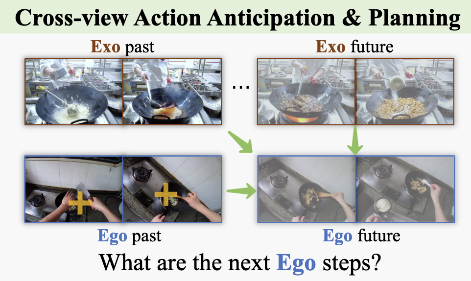

# EgoExoLearn: Cross-View Action Anticipation and Planning

This is the codebase of cross-view action anticipation and planning.

## Requirements
* support Python 3.9, PyTorch 2.0.1, CUDA 11.8, CUDNN 8.7.0
* install all the library with: `pip install -r requirements.txt`
---

## Data Preparation
We use CLIP feature extracted at 5FPS. Firstly, you should download and unzip it from the main [README](../README.md) to your folder.
The annotations of action anticipation and planning are at [./anticpation_annotation](./anticpation_annotation/) and [./planning_annotation/](./planning_annotation/).

## Usage

All scripts of domain adaption and zero-shot settings are at [./scripts](./scripts/). 
For each script file, you should modify the `path_data_root` and `path_feat_root` to your folder. 
We use `training`, `testing` or `testing_source` to control the behavior of scripts.

---
### Acknowledgments

The codebase is based on [TA3N](https://github.com/cmhungsteve/TA3N).
We thank the authors for their efforts.

If you have any questions, feel free to contact Guo Chen (chenguo1177 <at> gmail.com)