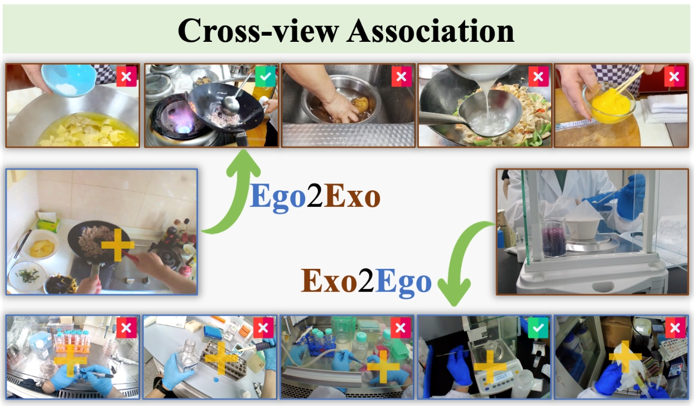

# EgoExoLearn: Cross-View Association
As a simple baseline, we train a video encoder using the video-text contrastive loss on ego-only/exo-only/egoexo data, and evaluate their cross-view association abilities.



## Prepare env
Install pytorch and dependencies. We use torch==1.13.1+cu117 other pytorch versions may also work. 
```bash
pip install -r requirement.txt
```

## Modify data path
Open ./configs/our_default.yml, replace the following paths with your own paths

```bash
ego_root: /path/to/your/egodata/
exo_root: /path/to/your/exodata/ 
metapath: /path/to/your/annotations/
```


The annotation files include:
```md
├── annotations/
│   ├── ego_train.csv
│   ├── exo_train.csv
│   ├── association_val_hard.json
```

## Training
0. (Optional) Download the Ego4d-pretrained [checkpoint](https://dl.fbaipublicfiles.com/lavila/checkpoints/dual_encoders/ego4d/clip_openai_timesformer_base.narrator_rephraser.ep_0001.md5sum_02dbb9.pth) from [LaViLA](https://github.com/facebookresearch/LaViLa), modify the config file (e.g. ./configs/train_egoonly.yml)
```
resume: /path/to/your/pretrained_checkpoint/
```


1. Train the model with ego-only data
```
python main.py --config ./configs/train_egoonly.yml
```

2. Train the model with exo-only data
```
python main.py --config ./configs/train_exoonly.yml
```

3. Cotrain the model with egoexo data
```
python main.py --config ./configs/train_egoexo.yml
```

By default, the checkpoints will be saved in './exps/' folder, you can modify them in the config file (e.g. ./configs/train_egoonly.yml) by setting:
```
output: /path/to/your/output_folder/
```

## Testing 
1. Modify the resumed checkpoint path in ./configs/test.yml:
```
resume: /path/to/your/trained_checkpoint/
```
2. Test the model
```
python main.py --config ./configs/test.yml
```

## Acknowledgement

The codebase is based on [LaVILA](https://github.com/facebookresearch/LaViLa).
We thank the authors for their efforts.
