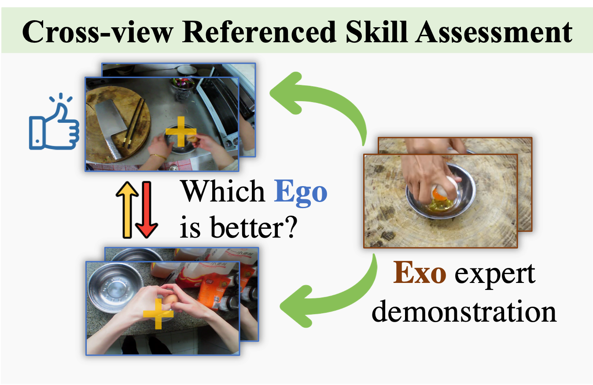

# Cross-view Referenced Skill Assessment with Rank-aware Attention Network
This is the benchmark code and annotations of the "Cross-view Referenced Skill Assessment Benchmark". The implementation is based on Rank-aware Attention Network from the paper 'The Pros and Cons: Rank-aware Temporal Attention for Skill Determination in Long Videos' [[Paper Link]](https://arxiv.org/abs/1812.05538).



## Label explaination

We provide explaination for each line in our label file ```train_split_skill.txt``` and ```val_split_skill.txt```.

For example, ```18_VID1_7242_7427 18_VID2_290_455``` means:

The left sample shows higher skill level than the right sample.

```VID1``` and ```VID2```: raw video file (25 fps)

```7242_7427```: from the 7242th frame to the 7427th frame

```18```: action

### Action list:
```
06: Peeling
13: Cutting into chunks
14: Slicing into strips
15: Chopping into pieces
18: Egg cracking
20: Stir-fry
```
Note that the IDs in this action list is irrelevant to any other parts of the dataset.


## Training and Validation Code

```python train.py```

## Data
Please download the extracted i3d features for Cross-view Referenced Skill Assessment form this [Google Drive link](https://drive.google.com/file/d/1O33TjyrIWYBXuTgoUb8HFdLjG2AMr-p9/view?usp=drive_link).

## Acknowledgement
This code is based on [RAAN](https://github.com/hazeld/rank-aware-attention-network).
We thank the authors for their efforts.

If you have any questions, feel free to contact Mingfang at mfzhang <at> iis.u-tokyo.ac.jp